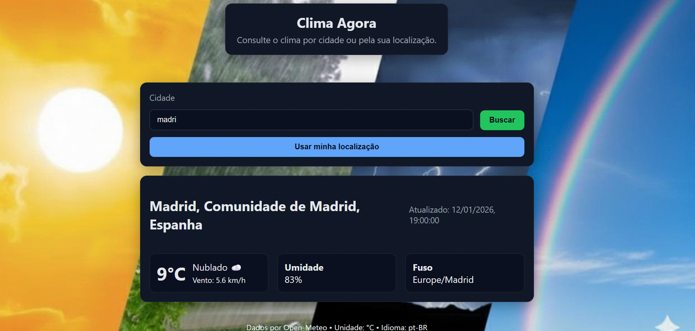

# 🌤️ Clima Agora — HTML + JavaScript (Open‑Meteo)

<p align="center">
  
</p>

Aplicação front-end que consulta o **clima atual** por **cidade** ou pela **sua localização**, usando a API pública **Open‑Meteo** (sem necessidade de chave).  
✅ **Deploy:** [https://jbechaire.github.io/api-clima-html-js/](https://jbechaire.github.io/api-clima-html-js/)

---

## ✨ Recursos
- Busca por cidade com **geocoding** (Open‑Meteo Geocoding).
- Clima atual com **Open‑Meteo Forecast** (sem API key).
- Botão **“Usar minha localização”** (navigator.geolocation).
- UI amigável em cards, com estados de **carregando** e **erro**.
- Cache simples de última cidade e coordenadas (`localStorage`).

---

## 🗂️ Estrutura
api-clima-html-js/
├─ index.html
├─ assets/
│  ├─ css/styles.css
│  └─ js/
│     ├─ app.js
│     ├─ ui.js
│     └─ services/
│        ├─ config.js
│        ├─ geoService.js
│        └─ weatherService.js
└─ README.md

    ---

## 🚀 Como rodar localmente
```bash
# Opção 1: Live Server (VS Code)
# Instale a extensão e clique em "Go Live"

# Opção 2: Python
python -m http.server 5500

# Opção 3: Node
npx http-server .

#Acesse: http://localhost:5500

## 🌐 APIs utilizadas

#Geocoding:
#https://geocoding-api.open-meteo.com/v1/search?name={cidade}&count=1&language=pt
#Forecast:
#https://api.open-meteo.com/v1/forecast?latitude={lat}&longitude={lon}&current=temperature_2m,relative_humidity_2m,wind_speed_10m,weather_code&timezone=auto


